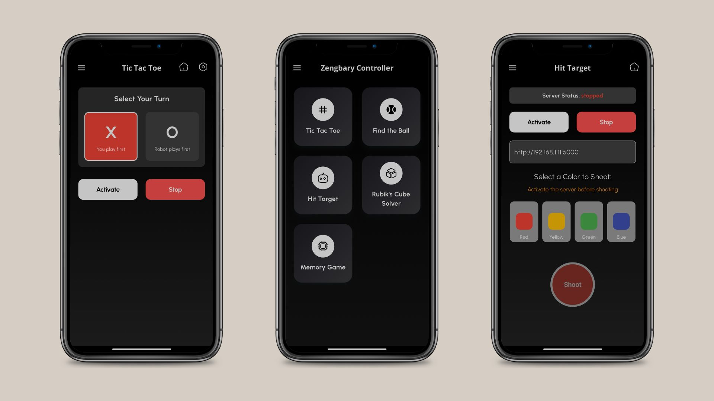

# Zengbary



A Flutter application for remotely controlling color-based target shooting and playing games like Tic Tac Toe through a backend server.

## Features

- **Hit Target Game**: Control color-based target shooting with red, blue, and yellow targets
- **Tic Tac Toe Game**: Play Tic Tac Toe through the remote server
- **Server Management**: Start and stop games from the application
- **Dynamic Configuration**: Update server URL for flexible deployment

## Getting Started

### Prerequisites

- Flutter SDK (version ^3.7.0)
- Dart SDK
- Android Studio / VS Code with Flutter extensions
- A compatible backend server (Python-based target control server)

### Installation

1. Clone the repository:

   ```bash
   git clone https://github.com/yourusername/zengbary.git
   cd zengbary
   ```

2. Install dependencies:

   ```bash
   flutter pub get
   ```

3. Run the application:
   ```bash
   flutter run
   ```

## API Communication

The application uses Dio for HTTP requests with the following features:

- 7-second timeout for all API connections
- Comprehensive error handling for various network scenarios
- JSON-based communication with the server

### API Endpoints

- `/start` - Activates the server
- `/stop` - Stops the server
- `/color` - Fires a specific color (red, blue, or yellow)
- `/changeGame?game=xo` - Changes to Tic Tac Toe game
- `/changeGame?game=idle` - Returns to idle state

## Architecture

The application follows a clean architecture with:

- Separation of UI and business logic
- Dedicated HTTP client with proper error handling
- Responsive UI design that works on multiple device sizes

## Usage

### Hit Target Game

1. Start the application and navigate to "Hit Target" from the home screen
2. Enter your server's base URL in the input field
3. Click "Activate" to start the server
4. Select a color (red, blue, or yellow)
5. Press the "Shoot" button to fire at the target
6. Click "Stop" when finished

### Tic Tac Toe

1. Navigate to "Tic Tac Toe" from the home screen
2. Click "Activate" to start the game
3. Play according to the server's implementation
4. Click "Stop" when finished

## Troubleshooting

If you encounter connection issues:

- Verify the server URL is correct
- Ensure the server is running
- Check your network connection
- Review the error messages displayed in the UI

## License

This project is licensed under the MIT License - see the LICENSE file for details.

## Acknowledgments

- Iconsax for the icon pack
- Flutter and Dart teams for the amazing framework
